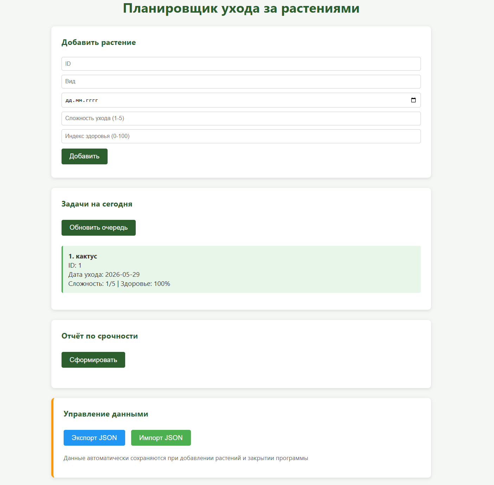

# Планировщик ухода за растениями

**Автор:** Мухаметов С.М.
**Группа:** ТОП-ИТ-101Б

## Описание проекта

Простое MVP веб-приложения для создания заметок и планирования ухода за комнатными растениями. Приложение позволяет пользователям добавлять растения, вести журнал
наблюдений, устанавливать напоминания о поливе и других процедурах, а также отслеживать состояние добавленных растений.

## Структура проекта

project/ 
├── public/ # Статические файлы для фронта 
├── src/ # Исходный код 
│ ├── algorithm/ # Алгоритмы обработки данных 
│ ├── core/ # Основная логика приложения 
│ ├── structures/ # Структуры данных 
│ └── server.js # Точка входа сервера 
├── test/ # Тесты 
├── demo.js # Демонстрационный скрипт 

## Ключевые компоненты

- **server.js** — обработка запросов, логика работы с заметками и напоминаниями.
- **папка public** — статические HTML, CSS файлы для интерфейса пользователя.
- **папка src, всё кроме server.js** — модули для обработки данных о растениях.

## Технологии

- **Backend:** Node.js
- **Frontend:** HTML, CSS, JavaScript
- **Сервер:** Express JS
- **Управление зависимостями:** npm

## Установка и запуск

1.  Клонируйте репозиторий: 
    git clone https://github.com/Shade-Angel/project.git 
    cd project 

2.  Установите зависимости 
    npm install 

3.  Запустите сервер 
    node src/server.js

    Или  
    npm start

4.  Откроестся браузер, если не открылся надо открыть браузер вручную и перейти по адресу(http://localhost:3000).

5.  Также можете запускать тесты и демо вариант (нужен отделный терминал)

- Тесты 
  node test/test.js

- Демо 
  node demo.js

## Скачать

Чтобы скачать приложение нужно найти Releases на GitHub и скачать самую новую доступную версию 
После скачивания достаточно просто запустить .exe файл plant-care.exe 
Файл plant-care.exe можно запустить в тестовом режиме, нужено добавить всего лишь флаг --test 

## Скриншоты приложения

